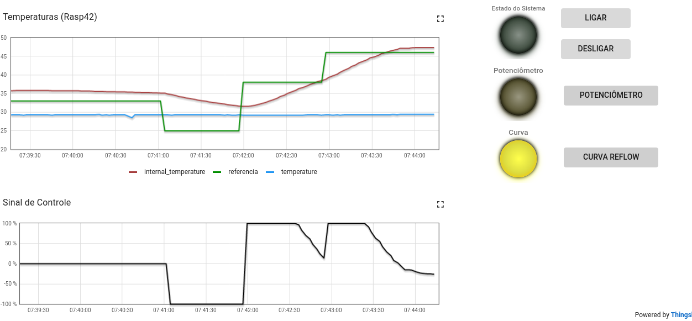

# Trabalho 1
## fundamentos de sistemas embarcados 2021.2

Aluno | Matricula
--|--
Matheus Gabriel Alves Rodrigues | 180106970

### Sobre

O projeto consiste em criar um sistema que faz a implementação de um sistema (que simula) 
o controle de um forno para soldagem de placas de circuito impresso (PCBs)

### Como executar

O repositório possui um `Makefile` portanto se faz necessário possuir o **make** instalado 
e seguir os passos a seguir:

* Limpa alguma compilação prévia:
`make clean`

* Compila os scripts do projeto
`make all`

* Executa a aplicação
`make run`
