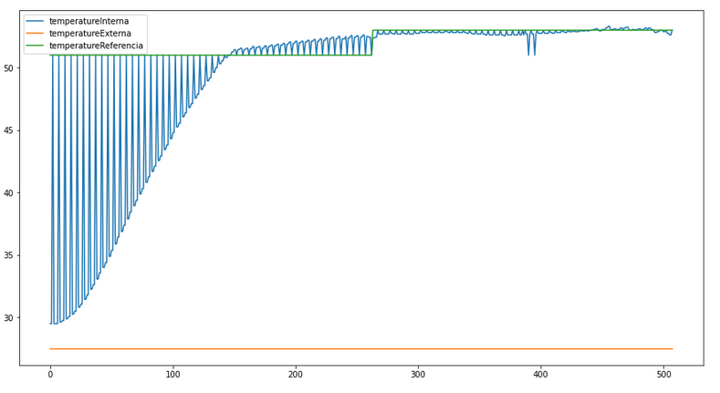

# Trabalho 1
## fundamentos de sistemas embarcados 2021.2
Aluno | Matricula
--|--
Matheus Gabriel Alves Rodrigues | 180106970

### Sobre

O projeto consiste em criar um sistema que faz a implementação de um sistema (que simula) 
o controle de um forno para soldagem de placas de circuito impresso (PCBs)


### Como executar

O repositório possui um `Makefile` portanto se faz necessário possuir o **make** instalado 
e seguir os passos a seguir:

* Limpa alguma compilação prévia:

```bash
make clean
```

* Compila os scripts do projeto

```bash
make all
```

* Executa a aplicação

```bash
make run
```

### Gráficos das coletas

Foram realizadas coletas para demonstrar o funcionamento do sistema, as coletas se encontram armazenadas
na pasta `static`, contendo:

Nome do arquivo | Modo | Tempo
--|--|--
coleta_modo_curva.csv | Modo curva | 10 minutos
coleta_modo_potenciometro.csv | Modo potenciometro | 5 minutos

##### Gráfico modo curva


##### Gráfico modo potenciômetro


